# Instalación de MySQL 8.0.16.0

Esta es la documentación para la instalación y configuración de MySQL 8.0.16.0 en Windows.

- [Instalación de MySQL 8.0.16.0](#Instalaci%C3%B3n-de-MySQL-80160)
  - [Link de descarga](#Link-de-descarga)
  - [Proceso de instalación](#Proceso-de-instalaci%C3%B3n)

## Link de descarga

Para descargarlo, solo debes entrar a [MySQL Site](https://dev.mysql.com/downloads/installer/) y utilizar la versión indicada, o alguna versión más reciente.
Una vez elegido la versión y el sistema operativo que es Windows, descargamos el archivo.

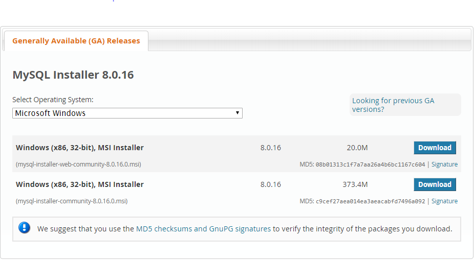

## Proceso de instalación

Para instalar, solo debes ejecutar el archivo que se descargó y esperar a seguir el proceso de instalación.

**Primero debemos aceptar los términos y condiciones del programa. Si existe alguna duda al respecto se puede leer los términos y condiciones que maneja la aplicación.**

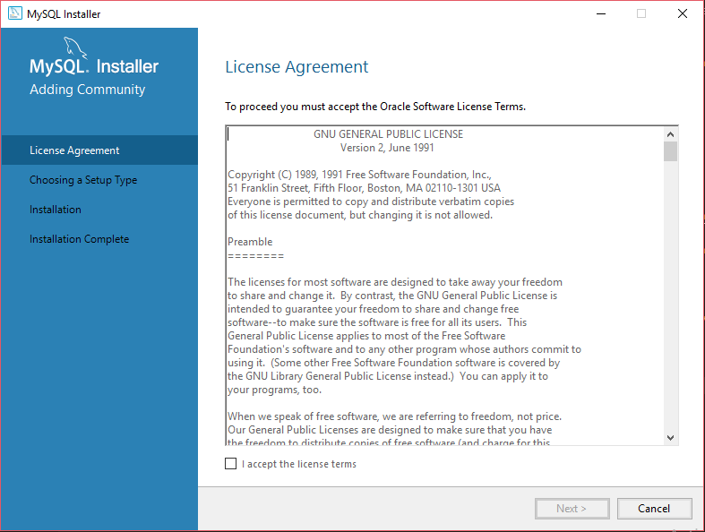

**Ahora, en la siguente ventana, podemos seleccionar la opción que esta por default. En mi caso solo tomaré algunos componentes necesarios; por lo tanto seleccionaré la opcion de CUSTOM.**

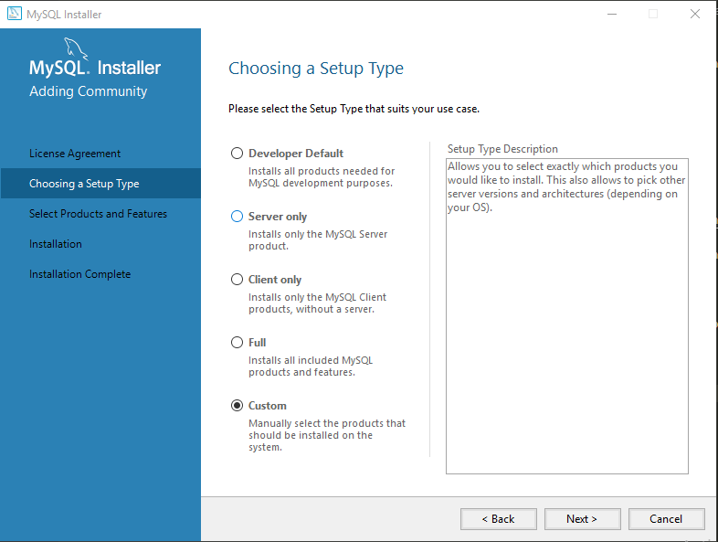

**Como ya he mencionado anteriormente, solo agregaré los componentes así como se muestra en la siguiente imagen. Y damos en la opción de Next.**

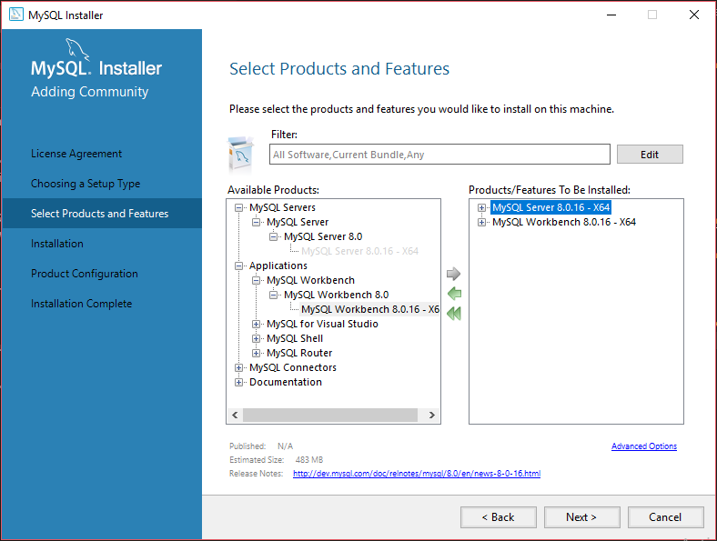

**En la siguiente ventana, veremos que este listo cada uno de los componente que se agregaron con la palabra de "Ready"; y damos en "Execute".**

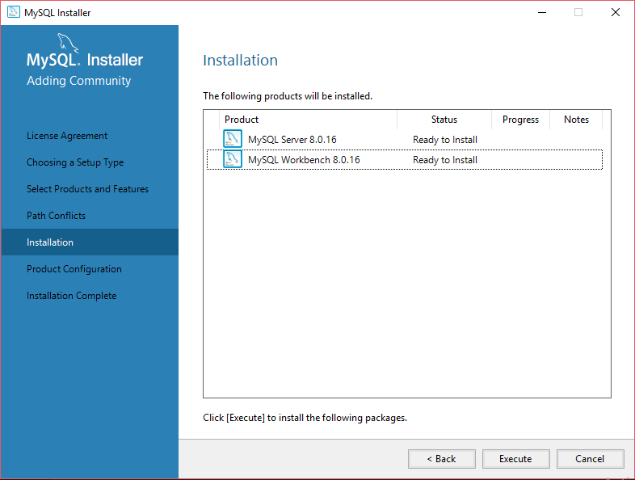

**Una vez completado, damos  en "Next".**

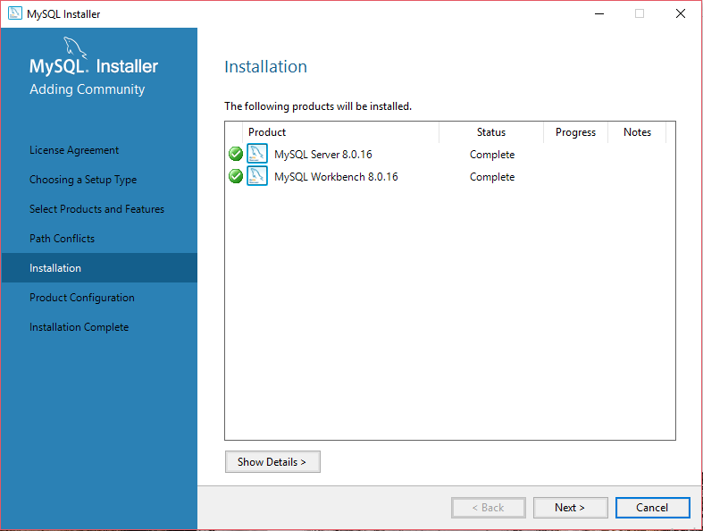

**Después seleccionamos la opción como se muestra en la imagen.**

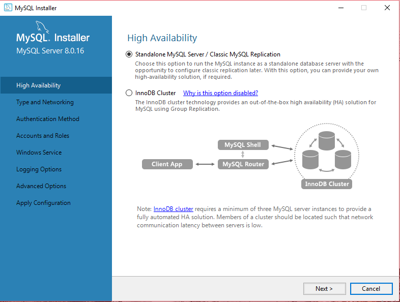

**Ahora vamos a seleccionar la opción de "Development Computer". Recomiendo que el puerto sea el 3306, yo aquí usaré el 3307 ya que el puerto 3306 ya esta en uso. Si tienes el mismo caso, puesdes usar entre los puertos 3306-3309.**

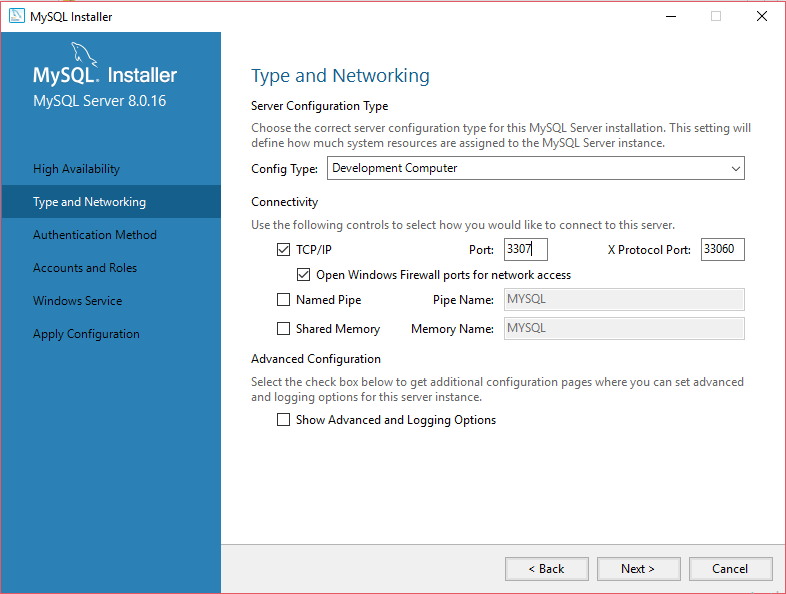

**En la siguiente imagen usamos la primera opción.**

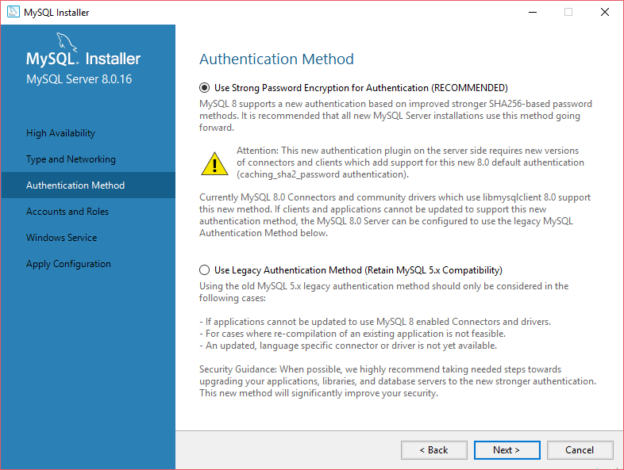

**En esta imagen solo me pide a mi una contraseña. En tu caso deberá pedirte igual alguna contraseña y que la confirmes. Y le das en continuar.**

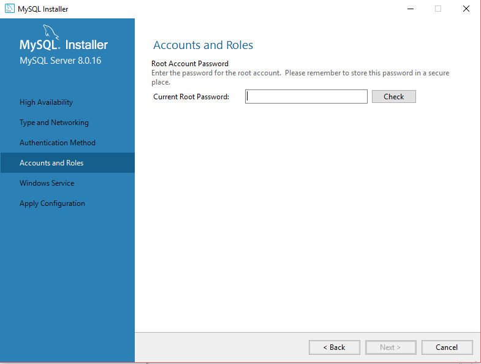

**En la siguiente ventana puedes dejar la confic¿guración como se muestra la imagen, o puedes cambiar alguna opción a como lo veas mejor conveniente.**

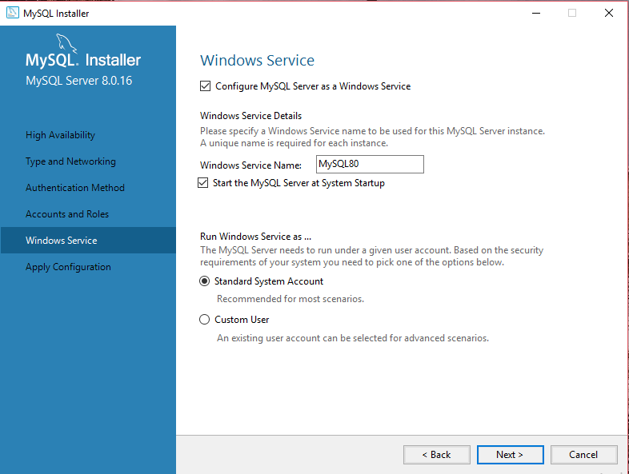

**En la siguiente ventana solo le das en la opción de "Execute", y esperas a que termine.**

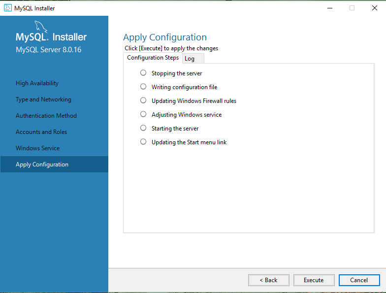

**Y ahora como último punto, solo damos en finalizar, y el programa de MySQL se iniciará.**

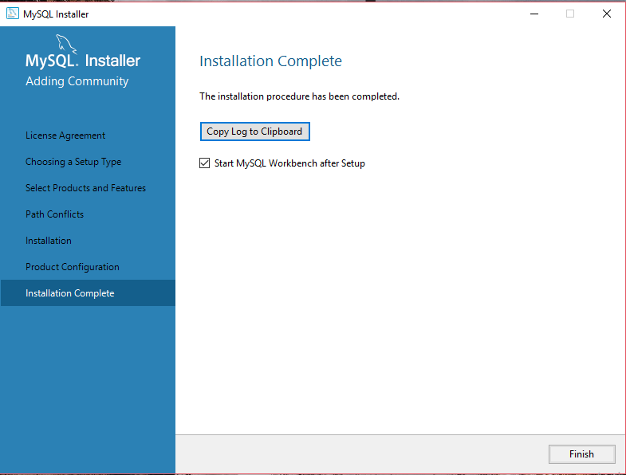
